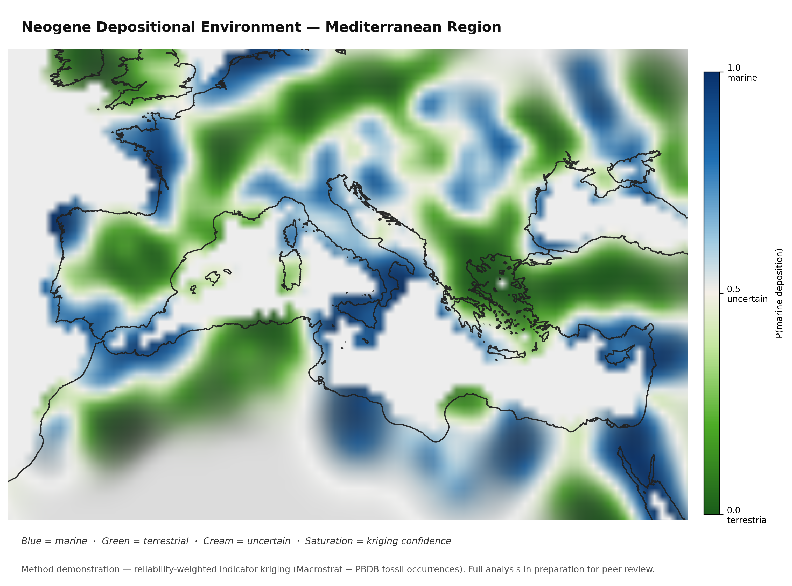

# Cenozoic Depositional-Environment Kriging

**Multi-source, reliability-weighted, declustered indicator kriging of marine vs. terrestrial depositional environment with explicit uncertainty surface.**

> Full analysis (~831k observations, Macrostrat + PBDB) is in preparation for peer review.  
> This repository contains the method pipeline and a synthetic sample dataset so you can run it end-to-end.


*Example output on synthetic sample data (441 observations). Full analysis in preparation for peer review.*

---

## What this does

Maps the probability of marine vs. terrestrial depositional environment across global land surfaces for three Cenozoic epochs (Paleogene / Neogene / Quaternary). The key design choices:

| Choice | Rationale |
|--------|-----------|
| **Reliability weighting** | Macrostrat `environment_class` (direct rock-unit classification) weighted 5× over fossil occurrences (collection-biased toward terrestrial vertebrates in NA, marine invertebrates in Tethys) |
| **Declustering** | Observations binned to 0.5° cells with weighted mean P(marine) — collapses dense clusters before kriging so no region over-dominates |
| **Confidence modulation** | Kriging variance mapped to color saturation: high-variance (data-sparse) pixels desaturate toward cream. The uncertainty gradient **is** the map's key message |
| **Resolution-independent coverage** | Coverage reported as fraction of land within one variogram range of an observation — not a pixel-count artifact that changes with grid resolution |
| **Variogram capping** | maxlag prevents fitting long-range continental trends; hard range cap prevents geologically implausible autocorrelation lengths |

The result: a fully colored map where saturation tells you how much to trust each pixel.

---

## Stack

- **Python 3.9+**
- [PyKrige](https://github.com/GeoStat-Framework/PyKrige) — ordinary kriging
- [scikit-gstat](https://github.com/mmaelicke/scikit-gstat) — variogram fitting
- [GeoPandas](https://geopandas.org) / [pyproj](https://pyproj4.github.io/pyproj/) — projection (EPSG:8857 Equal Earth)
- [matplotlib](https://matplotlib.org) — rendering with confidence-modulated colormap
- [pandas](https://pandas.pydata.org) / [numpy](https://numpy.org) / [scipy](https://scipy.org)

Full analysis additionally uses **PostgreSQL/PostGIS** with Macrostrat and PBDB tables.

---

## Quick start

```bash
git clone https://github.com/nealdoran/cenozoic-env-kriging
cd cenozoic-env-kriging
pip install -r requirements.txt

# Generate synthetic sample data (441 obs, geographically plausible, NOT real data)
python generate_sample_data.py

# Run pipeline — Paleogene epoch, 300km grid
python krige_env.py --epoch Paleogene --grid_km 300

# Other options
python krige_env.py --epoch Neogene   --grid_km 200
python krige_env.py --epoch Quaternary --grid_km 200 --cap_km 800
python krige_env.py --help
```

Output figures go to `figures/`.

---

## Pipeline steps

```
krige_env.py
├── load_observations()      CSV → indicator (1=marine, 0=terrestrial, 0.5=marginal)
│                            + epoch assignment (ICS 2023 boundaries)
├── bin_observations()       0.5° weighted grid-bin → P_marine per cell
│                            (declusters + applies source weights simultaneously)
├── fit_variogram()          Spherical variogram (scikit-gstat), maxlag + range cap
├── krige()                  Ordinary kriging onto Equal-Earth grid (pykrige)
├── coverage_fraction()      % of grid within 1 variogram range (resolution-independent)
└── render()                 Confidence-modulated RGBA → figure
```

---

## Data schema

`data/sample_observations.csv`:

| column | type | description |
|--------|------|-------------|
| `lat` | float | Latitude (WGS84) |
| `lng` | float | Longitude (WGS84) |
| `environment` | str | `marine` \| `terrestrial` \| `marginal` |
| `age_ma` | float | Age in Ma (ICS 2023) |
| `source` | str | `macrostrat` \| `fossil` (affects weight) |
| `weight` | float | Source reliability weight |

The synthetic dataset has 441 rows across geographically plausible clusters. It is **not** real PBDB or Macrostrat data.

---

## Honesty design

This pipeline is built around making uncertainty explicit rather than hiding it:

1. **Two independent sources** are combined with explicit reliability weights, not silently merged
2. **Kriging variance** is computed alongside P_marine and drives color saturation — a reviewer sees immediately where the estimate is soft
3. **Coverage is reported honestly** using a distance metric that doesn't change when you change grid resolution
4. **Captions state** that this is a statistical estimate, not a unit map

A saturated blue pixel means "marine, well-constrained." A cream pixel means "uncertain — look at the coverage fraction before interpreting."

---

## Citation / status

> Doran, N.A. *Global Cenozoic depositional environment reconstruction via multi-source indicator kriging.* In preparation.

Full analysis in preparation for peer review. Method code here is MIT-licensed and freely reusable.

---

## License

MIT — see `LICENSE`.
